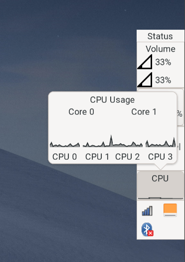

# pystatus

Configurable status window and/or bar for wayland compositors with support for
the wlr-layer-shell protocol.



## Features

- TOML configuration.
  - Supports configuration of different bars, and choice of bar at startup with
    commandline argument.
- A variety of built-in modules:
  - System tray module ([StatusNotifierItem protocol](https://www.freedesktop.org/wiki/Specifications/StatusNotifierItem/)), with Dbusmenu.
  - Cpu monitor module, with usage graphs.
  - MPRIS module.
  - Battery module.
  - Volume module.
- Remote interface through dbus, currently allowing:
  - Show/hide/toggle bar or status window.

## Running without installing

The project is built using [Poetry](https://python-poetry.org/).
To run, clone the project

```
git clone https://github.com/mbrea-c/pystatus.git
```

move to the cloned directory

```
cd pystatus
```

install dependencies in a local venv with

```
poetry install
```

and run pystatus with

```
poetry run pystatus <bar name>
```

## User-wide installation from source

The project is built using [Poetry](https://python-poetry.org/).

To build
locally, clone the project

```
git clone https://github.com/mbrea-c/pystatus.git
```

move to the cloned directory

```
cd pystatus
```

and build

```
poetry build
```

This will create two files in the `dist` directory,

```
dist/pystatus-<version_number>.tar.gz
dist/pystatus-<version_number>-py3-none-any.whl
```

For a user-wide installation, run

```
cd dist
pip install --upgrade pystatus-<version_number>.tar.gz
```
